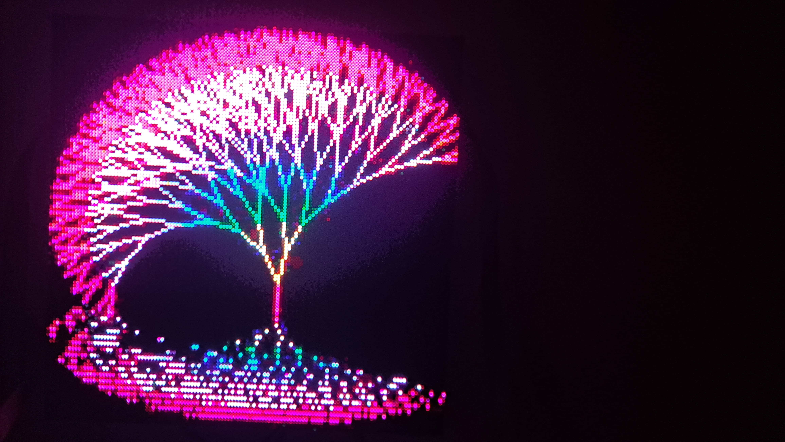

# ESP32 drive 4 64x64 led panels (HUB75)



The website runs the TIC80 retro tiny computer https://github.com/nesbox/TIC-80
Inside the TIC80 terminal you can upload carts using the `add` command.
Then use `load <filename>` to load the cart and then `run` to run it.
The ESP32 Arduino code acts as a TCP client and connects to the Golang server.
The website streams frames to the Golang server via WebSocket protocol.

## Prerequisites

- Golang

## Usage

1. First edit the Arduino code with the Wifi SSID and password.
Then upload the code to the ESP32 and make sure it's wired up according to
https://github.com/mrfaptastic/ESP32-HUB75-MatrixPanel-DMA#2-wiring-the-esp32-to-an-led-matrix-panel

2. Run this command to build and start the server

```
$ make ci
```

3. Go to http://127.0.0.1:8080/
